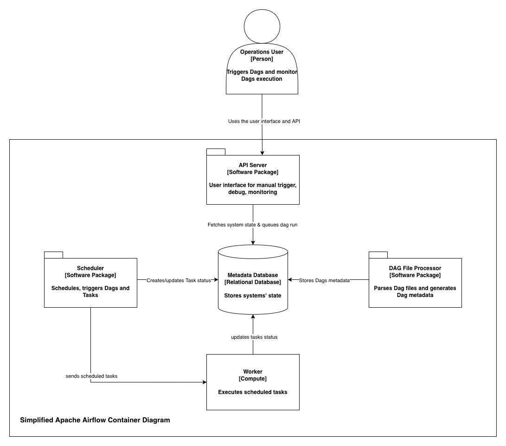

+++
title = "Beginners introduction to Apache Airflow"
date = '2026-01-26T09:56:33+01:00'
draft = false
showAuthorBottom = true
+++

# Introduction

This article is an introduction to Apache Airflow. Its target audience is anyone who wants to understand the basic concepts of Apache Airflow.

The goal of this article is to present what Airflow is, where it comes from, what it can be used for, and the basic concepts to grasp before going further.

Apache Airflow is an open-source workflow authoring, scheduling, and monitoring tool that originated from Airbnb in 2014. It joined the Apache Foundation in 2016 and has since then been developed by the community. The latest major version of Apache Airflow is version 3.x. This article presents the concepts regarding the major version 3.x.

Apache Airflow is a versatile workflow orchestration tool used for a wide range of use cases. From infrastructure management - spin up and tear down infrastructure resources as needed -, to data pipelines orchestration - Extract Transform Load (ETL), Extract Load Transform (ELT) -, Apache Airflow can be used for any use case with a set of steps executed sequentially or in parallel.

A major benefit in using Apache Airflow is workflow definition as code. This way, we can apply software management principles like versioning, CI/CD pipelines to managing workflows. Apache Airflow also provides a handy graphical user interface to debug workflows execution logs, manually trigger workflows.

# Airflow Concepts

Authoring and managing workflows is at the core of Apache Airflow. A workflow is a collection of tasks executed in a specific order. Apache Airflow represents workflows as Directed Acyclic Graphs (DAG). Directed means that there is dependency between the tasks, an order of execution, Acyclic implies that no loop is allowed in Apache Airflow workflows.

## What is a DAG?

A DAG is the model that represents a workflow in Apache Airflow and all the metadata associated with it:

- Describes the workflow's tasks
- Describes dependencies between tasks (execution order)
- Workflow run schedule
- Workflow start and end dates

A DAG defines what tasks the workflow is made of but doesn't do the actual work. That is the job of workflow's tasks.

**Method 1: Context Manager (recommended)**

```python
from airflow import DAG
from datetime import datetime

with DAG(
    dag_id="my_dag",
    start_date=datetime(2024, 1, 1),
    schedule="@daily",
    catchup=False,
) as dag:
    # Tasks defined here are automatically assigned to this DAG
    pass
```

**Method 2: DAG Class Constructor**

```python
from airflow import DAG
from datetime import datetime

dag = DAG(
    dag_id="my_dag",
    start_date=datetime(2024, 1, 1),
    schedule="@daily",
    catchup=False,
)

# Tasks must explicitly reference the dag parameter
# task = SomeOperator(..., dag=dag)
```

**Method 3: TaskFlow Decorator**

```python
from airflow.decorators import dag
from datetime import datetime

@dag(
    dag_id="my_dag",
    start_date=datetime(2024, 1, 1),
    schedule="@daily",
    catchup=False,
)
def my_workflow():
    # Define tasks using @task decorator inside
    pass

my_dag = my_workflow()
```

## Tasks, Operators

Tasks are the unit of execution in a workflow. This where the actual work happens. Tasks are defined in `Operators`. Apache Airflow provides multiple operators out-of-the-box like `BashOperator`, `PythonOperator` that provide the capabilities to execute respectively bash and python code.

In the object-oriented context, a `Task` is an instance of the `Operator` class. `BashOperator`, and `PythonOperator` can only offer limited capabilities for complex workflows that must be integrated with external services like cloud providers, data platform, ...
This is where `Providers` come in handy.

**Method 1: Context Manager**

```python
from airflow import DAG
from airflow.operators.bash import BashOperator
from airflow.operators.python import PythonOperator
from datetime import datetime

def my_python_function():
    print("Hello from Python!")

with DAG(
    dag_id="my_dag",
    start_date=datetime(2024, 1, 1),
    schedule="@daily",
) as dag:
    # Tasks are automatically assigned to the DAG
    task1 = BashOperator(
        task_id="bash_task",
        bash_command="echo 'Hello from Bash!'",
    )

    task2 = PythonOperator(
        task_id="python_task",
        python_callable=my_python_function,
    )

    # Define task dependencies
    task1 >> task2
```

**Method 2: DAG Class Constructor**

```python
from airflow import DAG
from airflow.operators.bash import BashOperator
from airflow.operators.python import PythonOperator
from datetime import datetime

def my_python_function():
    print("Hello from Python!")

dag = DAG(
    dag_id="my_dag",
    start_date=datetime(2024, 1, 1),
    schedule="@daily",
)

# Tasks must explicitly reference the dag parameter
task1 = BashOperator(
    task_id="bash_task",
    bash_command="echo 'Hello from Bash!'",
    dag=dag,
)

task2 = PythonOperator(
    task_id="python_task",
    python_callable=my_python_function,
    dag=dag,
)

# Define task dependencies
task1 >> task2
```

**Method 3: TaskFlow Decorator**

```python
from airflow.decorators import dag, task
from datetime import datetime

@dag(
    dag_id="my_dag",
    start_date=datetime(2024, 1, 1),
    schedule="@daily",
)
def my_workflow():
    @task
    def extract():
        return {"data": [1, 2, 3]}

    @task
    def transform(data: dict):
        return {"transformed": [x * 2 for x in data["data"]]}

    @task
    def load(data: dict):
        print(f"Loading: {data}")

    # TaskFlow automatically infers dependencies from function calls
    raw_data = extract()
    transformed_data = transform(raw_data)
    load(transformed_data)

my_dag = my_workflow()
```

## Providers

`Providers` extend the core capability of Apache Airflow. They provide `Operators`, `Sensors`, and other capabilities that streamline Apache Airflow integration with external systems.

Providers are installed independently from the core Apache Airflow. Capabilities provided by providers are automatically detected upon restart of Apache Airflow after the provider is installed.

# Airflow Structure

Apache Airflow is a complex system made of multiple components. It can be installed as a distributed system (recommended for production) or as a single deployment system.

The following components make the Apache Airflow magic work:

## Scheduler

The `Scheduler` is the brain of Apache Airflow. It checks the metadata database for `DAGs` to schedule and trigger them. Submits `Tasks` to the executor (part of the `Scheduler`) to run.

## API Server

Provides a graphical user interface and an API to inspect, debug, trigger DAGs and tasks.

## Dag File Processor

Continuously scans `Dag folder` for new DAGs to parse and serialize into the metadata database.

## Metadata database

The metadata database is the source of truth of the whole system. It stores the state of DAGs and tasks. Supports PostgreSQL, MySQL, and SQLite (not recommended for production).

<!-- [Airflow Diagram](./airflow-container-diag.drawio.png) -->



# Conclusion

To conclude this article, let's understand that Apache Airflow is a versatile workflow orchestration tool used for various use cases. It provides the capability to define workflows as code and provides a handy graphical user interface to debug, inspect, and trigger DAGs and tasks.

For more advanced topics on Apache Airflow, please head over the [official documentation](https://airflow.apache.org/docs/).
